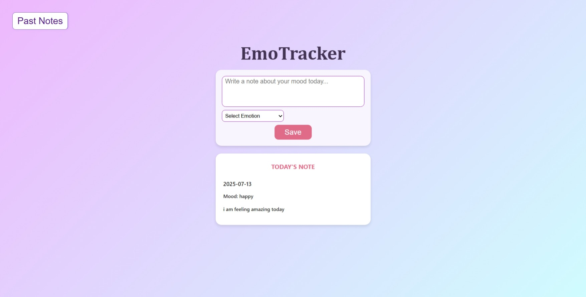
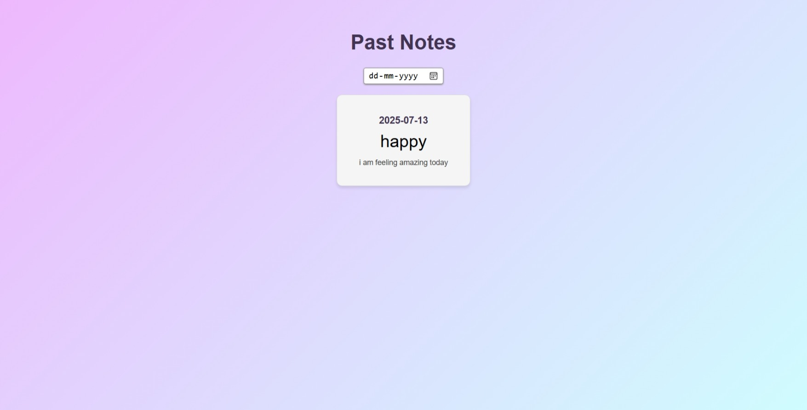

<h1 align="center">🌸 EmoTracker</h1>

<p align="center">
  A minimal, cute, and soothing mood-tracking app built with <strong>React</strong> and <strong>Vite</strong>.  
  EmoTracker helps you express your emotions, journal your day, and reflect on how you feel — one entry at a time.
</p>

<p align="center">
  <a href="https://khushi05sharma.github.io/EmoTracker/" target="_blank"><strong>🌐 Live Demo</strong></a> •
  <a href="#-features">💡 Features</a> •
  <a href="#-screenshots">📸 Screenshots</a>
</p>

---

## 🧠 About EmoTracker

**EmoTracker** is a web-based mood diary where users can:
- ✍️ Write a short note about how they feel today
- 😊 Select an emotion that matches their mood
- 📅 View all past mood entries on a separate notes page
- 💖 Enjoy a soft pastel, emotion-focused UI that feels calm and friendly

It’s designed to be a personal space for emotional journaling and mood reflection.

---

## ✨ Features

- 📝 Add notes with selected mood and date
- 🎭 Emotion options with emoji labels
- 📆 Past Notes section to reflect on emotional history
- 🌈 Aesthetic, calming design
- 🔗 Deployed using GitHub Pages with hash-based routing support
- 📱 Responsive design for all devices

---

## 🚀 Live Demo

🔗 **Try it now:**  
👉 [https://khushi05sharma.github.io/EmoTracker/]
(https://khushi05sharma.github.io/EmoTracker/)

---

## 🛠 Tech Stack

| Tech             | Description                            |
|------------------|----------------------------------------|
| React            | Component-based frontend framework     |
| Vite             | Fast bundler and dev server            |
| React Router DOM | For navigation (with HashRouter)       |
| GitHub Pages     | Hosting & deployment                   |
| CSS              | Custom styling for UI/UX               |

---

## 📸 Screenshots

### 🌼 Home Page
<p align="center">
  
</p>

### 🗂 Past Notes Page
<p align="center">
  
</p>

---

## 🙋‍♀️ About Me
**Khushi Sharma**
Frontend Developer 💻 | UI/UX Enthusiast 🎨 | Aesthetic Thinker ✨ |
🔗 [GitHub](https://github.com/khushi05sharma)  

---

## 📜 License
This project is licensed under the MIT License.
Feel free to use, modify, and share it with proper credit. ✨

---

## 📦 Installation

To run this project locally:

```bash
git clone https://github.com/khushi05sharma/EmoTracker.git
cd EmoTracker
npm install
npm run dev

