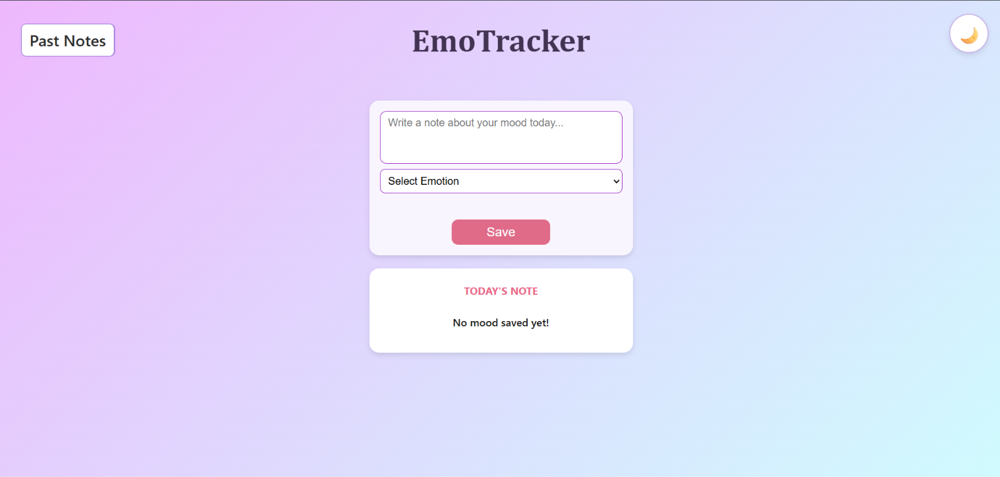
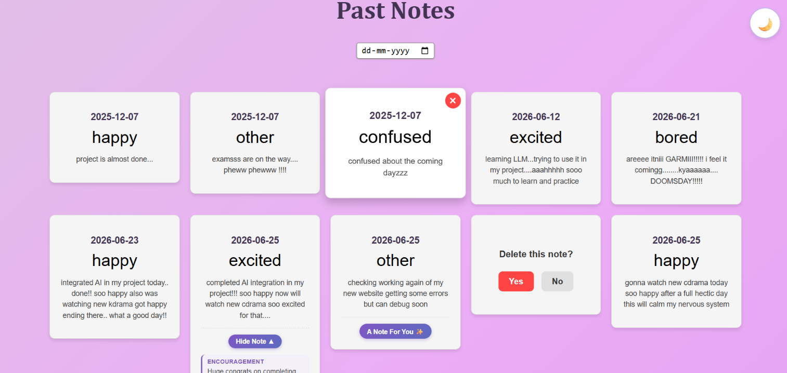

<h1 align="center">🌸 EmoTracker</h1>

<p align="center"> A minimal, calming mood-tracking app built with <strong>React</strong>, <strong>Express</strong>, and <strong>Google Gemini AI</strong>. EmoTracker helps users journal their emotions, receive thoughtful AI-powered reflections, and revisit past entries in a clean, soothing interface. </p>

<p align="center">
  <a href="https://khushi05sharma.github.io/EmoTracker/" target="_blank"><strong>🌐 Live Demo</strong></a> •
  <a href="#-features">💡 Features</a> •
  <a href="#-screenshots">📸 Screenshots</a>
</p>

---

## 🧠 About EmoTracker

**EmoTracker** is a personal mood journal that combines traditional journaling with AI-powered emotional support.
Users can:

- ✍️ Write about how they're feeling
- 😊 Choose the emotion that best matches their mood
- 🤖 Receive a personalized AI reflection powered by Google Gemini
- 💾 Save journal entries and AI insights locally using browser localStorage
- 📅 Browse previous entries anytime through the Past Notes page

It’s designed to be a personal space for emotional journaling and mood reflection.

---

## ✨ Features

- 📝 Daily mood journaling with Emotion selection
- 🤖 AI-generated encouragement, reflection, and tomorrow's suggestion
- 💾 AI insights saved alongside journal entries in localhost
- 💌 Expandable AI notes inside Past Notes
- 📆 Browse previous journal entries
- 🌈 Soft pastel responsive UI
- 🔒 Secure Express backend protecting the Gemini API key
- ⚡ Rate limiting to help prevent API abuse
- 📱 Responsive across desktop, tablet, and mobile

---

## 🚀 Live Demo

🔗 **Try it now:**  
👉 [https://khushi05sharma.github.io/EmoTracker/](https://khushi05sharma.github.io/EmoTracker/)

---

## 🛠 Tech Stack

| Tech              | Description                        |
| ----------------- | ---------------------------------- |
| React             | Component-based frontend framework |
| Vite              | Development & Build Tool           |
| React Router DOM  | Routing (HashRouter)               |
| Express.js        | Backend API                        |
| Google Gemini API | AI-generated insights              |
| Render            | Backend deployment                 |
| GitHub Pages      | Frontend deployment                |
| CSS               | Custom styling for UI/UX           |

---

## 📸 Screenshots

### 🌼 Home Page

<p align="center">
  
</p>

### 🗂 Past Notes Page

<p align="center">
  
</p>

---

## 🙋‍♀️ About Me

**Khushi Sharma**
MERN Stack Developer 💻 | UI/UX Enthusiast 🎨 |
🔗 [GitHub](https://github.com/khushi05sharma)

---

## 📜 License

This project is licensed under the MIT License.
Feel free to use, modify, and share it with proper credit. ✨

---

## 📦 Installation

To run this project locally:

```bash
git clone https://github.com/khushi05sharma/EmoTracker.git
cd EmoTracker
npm install
npm run dev

```
